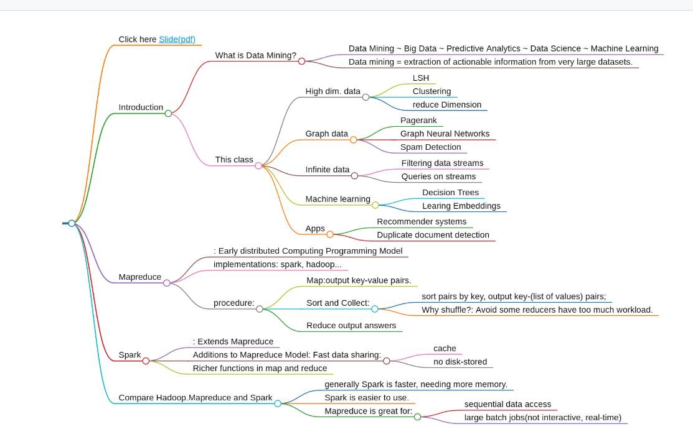

这一系列笔记内容是作者本人在23Spring上华科计算机系的大数据分析课程（大数据专业必修课）时所记录的笔记。该课程fork自Stanford CS246，做了一些课时上的删节和优化。注：从22级开始，该课程很可能采用考试而非考察形式结课，希望本系列笔记的内容有助于你的理解。

TODO：加一些图片。

## Click here [Slide(pdf)](https://web.stanford.edu/class/cs246/slides/01-intro.pdf)
# Introduction
## What is Data Mining?
### Data Mining ~ Big Data ~ Predictive Analytics ~ Data Science ~ Machine Learning
### Data mining = extraction of actionable information from very large datasets.

## This class 
### High dim. data
#### LSH 
#### Clustering
#### reduce Dimension
### Graph data
#### Pagerank
#### Graph Neural Networks
#### Spam Detection
### Infinite data
#### Filtering data streams
#### Queries on streams
### Machine learning
#### Decision Trees
#### Learing Embeddings
### Apps
#### Recommender systems
#### Duplicate document detection

# Mapreduce
## : Early distributed Computing Programming Model
## implementations: spark, hadoop...
## procedure:
### Map:output key-value pairs.
### Sort and Collect: 
#### sort pairs by key, output key-(list of values) pairs;
#### Why shuffle?: Avoid some reducers have too much workload.
### Reduce output answers

# Spark
## : Extends Mapreduce
## Additions to Mapreduce Model: Fast data sharing:
### cache
### no disk-stored
## Richer functions in map and reduce

# Compare Hadoop.Mapreduce and Spark
## generally Spark is faster, needing more memory.
## Spark is easier to use.
## Mapreduce is great for:
### sequential data access
### large batch jobs(not interactive, real-time)
