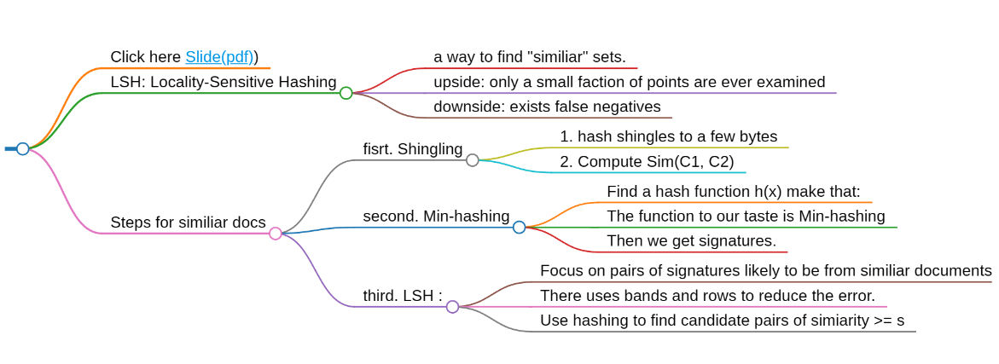

## Click here [Slide(pdf)](https://web.stanford.edu/class/cs246/slides/03-lsh.pdf))

## LSH: Locality-Sensitive Hashing 
### a way to find "similiar" sets.
### upside: only a small faction of points are ever examined
### downside: exists false negatives

## Steps for similiar docs
### fisrt. Shingling
Convert a document into a set
#### 1. hash shingles to a few bytes

#### 2. Compute Sim(C1, C2)
How to compute?

Fisrt define the Jaccard Similarity.

JS(not dis) = num of (equal items which not 0) / num of (all items)
dis = 1 - JS.

The smaller the dis, the more similar the two vectors are.
### second. Min-hashing
Convert large sets to short signatures, while preserving similarity.

#### Find a hash function h(x) make that:
if sim(C1, C2) is high, with high prob. h(c1) equal h(C2);

if low, with high prob. h(c1) != h(c2)
#### The function to our taste is Min-hashing
#### Then we get signatures.
### third. LSH : 
#### Focus on pairs of signatures likely to be from similiar documents
#### There uses bands and rows to reduce the error. 
See the slides page 40.
#### Use hashing to find candidate pairs of simiarity >= s

