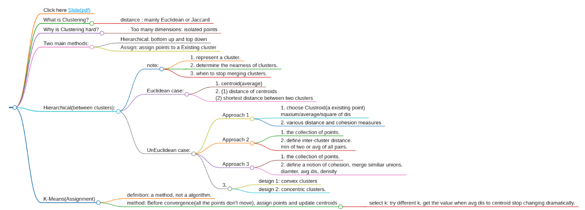

## Click here [Slide(pdf)](https://web.stanford.edu/class/cs246/slides/05-clustering.pdf)

## What is Clustering?
That is to say, given a set of **points**, We can define **a concept of distance** between these points. Then, we group the points into **some number of clusters**, which is known as "簇" in Chinese.  

### distance : mainly Euclidean or Jaccard

## Why is Clustering hard?
### Too many dimensions: isolated points

## Two main methods: 
#### Hierarchical: bottom up and top down
#### Assign: assign points to a Existing cluster

## Hierarchical(between clusters): 
### note:
1. represent a cluster.
2. determine the nearness of clusters.
3. when to stop merging clusters.
### Euclidean case:
1. centroid(average)
2. (1) distance of centroids
   (2) shortest distance between two clusters

### UnEuclidean case:

#### Approach 1
1. choose Clustroid(a exisiting point)
 maxium/average/square of dis 

2. various distance and cohesion measures
#### Approach 2
1. the collection of points.
2. define inter-cluster distance.
 min of two or avg of all pairs.
#### Approach 3
1. the collection of points. 
2. define a notion of cohesion, merge similiar unions.
 diamter, avg dis, density
#### 3.
##### design 1: convex clusters
##### design 2: concentric clusters.

## K-Means(Assignment)

#### definition: a method, not a algorithm.

### method: Before convergence(all the points don't move), assign points and update centroids

#### select k: try different k, get the value when avg dis to centroid stop changing dramatically.

 

