### 本blog内容是在开始复习期末考试前，先整理出要复习的主要内容和知识点。应考华科23Spring 计算机系数据库课程，适用于华科计算机系复习参考。


### TODO：完成前半部分内容的摘要整理

## 1、数据库考试试卷究竟考些什么？

### 数据建模

#### 涉及底层存储

### 关系代数

#### 给一个关系代数式子和数据表，要求算结果

#### 给一个需求，要求写关系代数表达式

### 范式

#### 分析范式类型

#### 分析依赖成立性

### 事务执行，并发控制

#### 问执行结果

#### 问生成的调度序列

#### 日志恢复

#### REDO和UNDO队列

#### 数据的变化

### ER图设计题

#### ER图以及各种码

#### ER图-》关系模型


### SQL查询

#### 写查询语句

#### 写查询优化的方式


### 安全控制策略：整体设计

## 2、数据库课程到底讲了哪些章节？分别有哪些重要的知识点？

### 一、绪论

#### 数据库系统概念

#### ！！数据模型！！
概念：数据及数据间关系的表达方式

分为：

##### 1、概念模型

独立于特定DBMS的现实世界的抽象模型。(用户与数据库
设计人员进行交流的语言)。

**可以理解为人用自然语言等对数据问题的建模。**

**重要概念：**

（1）实体：——客观存在可相互区别的事物和概念。(具体的人、事、物，抽象的概念)
例如：职工、学生、部门、课程。

（2）属性：——实体具有的特性。
Student (XH，XM，XB，NL)

（3）实体型：——具有相同特征和性质的实体与属性命名序列。 （就是把几个属性合成一条数据项的意思）
<!-- <div> </div> -->

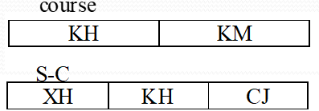
（4）实体值，即具体的数据取值。

（5）实体集（entity set）——同型实体值的集合

（6）域（domain）——属性的取值范围。

（7）码：码（KEY）——唯一标识一个实体集中任何实体值又不含多余属性的属性集。注意和后面某章节中的相关概念对应记忆。
Student (KEY)：XH

（8）联系：1对n，m对n等等。

##### 2、逻辑模型

（1）层次模型

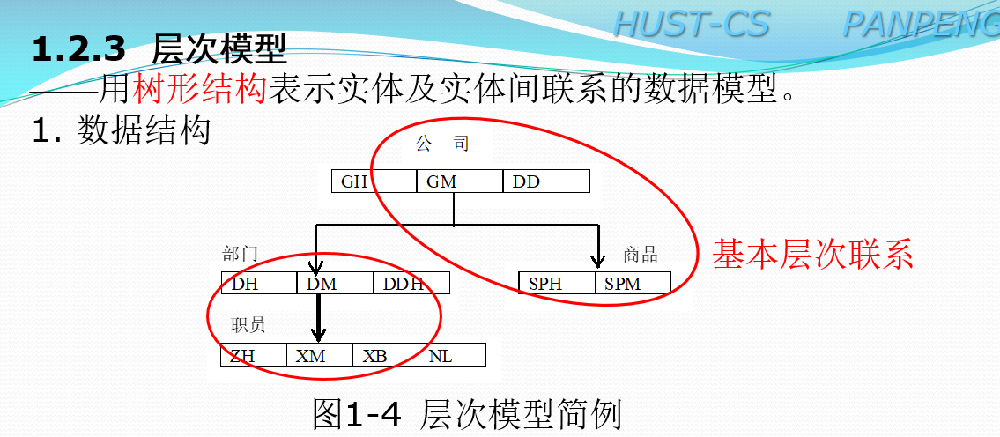

层次模型的存储结构
邻接法——前序遍历树的方式，通过物理地址的相邻体现层次顺序。
链接法——（子女－兄弟链接法）用指针来反映数据之间的层次关系，每个记录包含两类指针，分别指向最左边的子女和最近的兄弟。

（2）网状模型

去掉了根节点和双亲节点

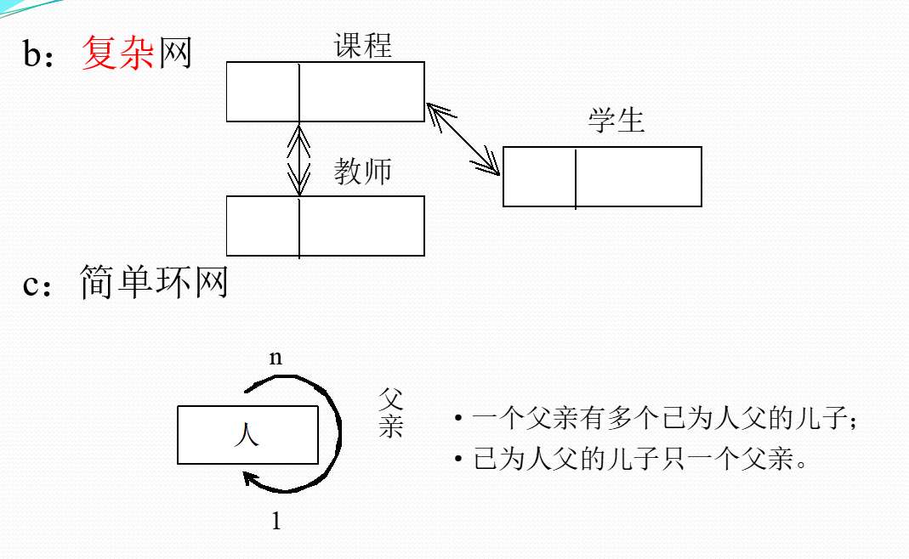

（3）关系模型

——用二维表格表示实体及其间联系的数据模型。

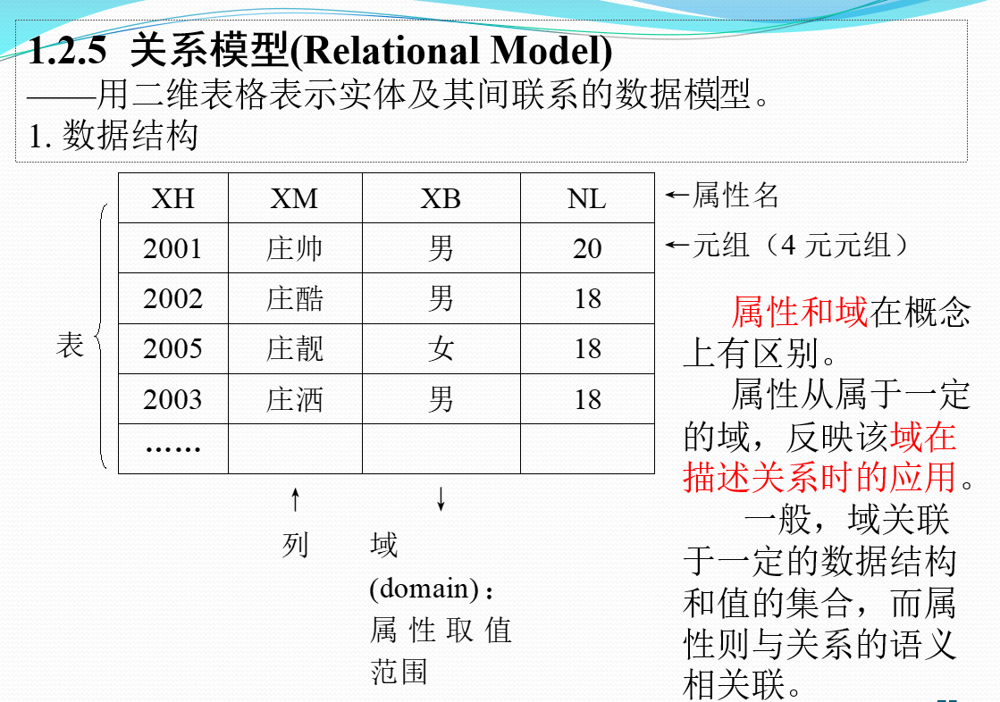

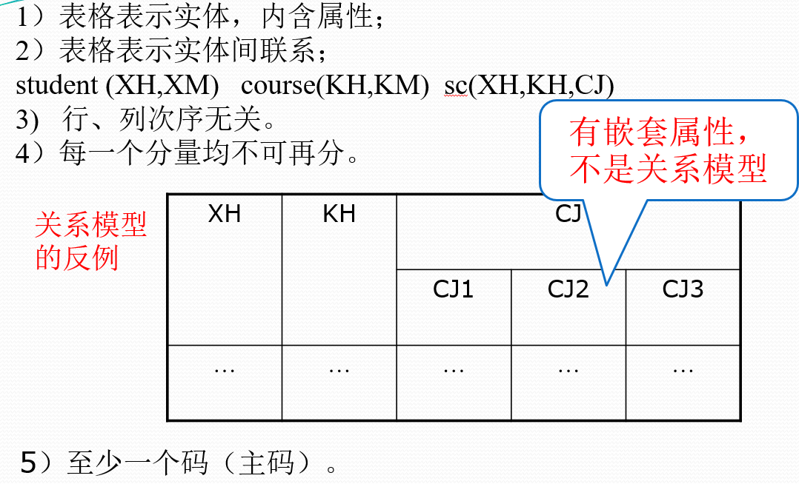

关系模型的约束：完整性约束：详见第五章：数据库完整性

3、物理模型

#### ！！模式概念！！

**三层模式，两级映像**：映像是模式和模式之间的桥梁

模式：DB中全体数据的逻辑结构及其特征的说明**逻辑特征**

外模式：DB中局部（局部用户）数据的逻辑结构及其特征的说明。**用户可见，放在外层的意思。相当于外部的显示和外部接口**

##### 外模式是模式的子集。

内模式：DB物理结构、存取路径及存取方法的说明**存储结构**

##### 映像：

1.外模式/模式映像
——说明外模式与模式间的对应联系（外模式中说明）。
模式改变，可以使外模式不变。

2.模式/内模式映像
——说明模式与内模式的对应关系（模式中说明）。
内模式改变，可以使模式不变。（逻辑结构在内部如何组织）


#### Extra:模型和模式

#### ！！DBMS体系结构（特点）！！

### 二、关系数据库

#### ！！关系相关的各项基本概念！！
域的概念、笛卡尔积

**关系**定义：
	D1xD2x…xDn的任意子集称为在域D1，D2，…，Dn上的关系。
记为：R(D1，D2，…，Dn),说明：
1）R为关系名，n为关系的目或度(degree)；
2）关系是一张二维表；
3）可多个候选码(candidate key)；
4）任选候选码之一为主码(primary key)。

外码(foreign key)
——对于R1和R2，A1，…，An为其属性子集，若A1，A2，…，An不是R1的码，但它是R2的码，且两者相对应，则称A1，…，An为R1的外码。

##### 关系模式(Relation Schema)
定义 ：关系的描述：R(A1，…，An)即：R(U，D，DOM，F)
R：关系名。

U：R中的属性名序列。

D：域(取值范围)。

DOM：属性到域的映象集(属性类型、长度)。

F：属性间数据依赖关系。

##### 关系的完整性：

1. 实体完整性(Entity integrity)
——主码属性不能为空，不同元组的主码取值不能重复。


2. 参照完整性(Referential integrity)
——若关系R1中含有另一个关系R2中主码的属性组F(作为R1的外部KEY)，则对于R1的每个元组在F上的值必须满足：
1）空，或者
2）等于R2中某个元组的主码值

**也就是说，要么不存在，要么一定在该属性作为主码的那张表中存在。**

3. 用户定义完整性(user-defined integrity)
——用户定义的约束。
出租期限≤20年，         工资≥2000元 

#### ！！关系代数！！

定义：用对关系的运算来表达查询，的一种传统方式。


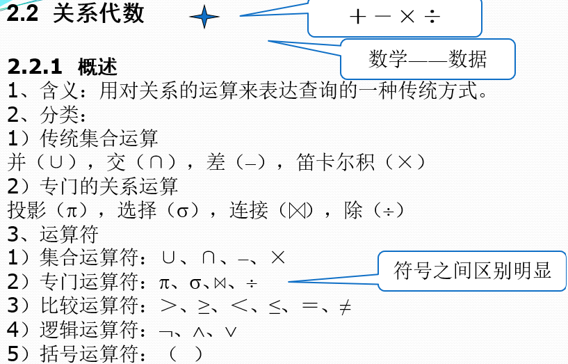

各种集合运算、关系运算：5种基本的运算：**并、差、笛卡尔积、投影、选择**

特别要注意的：自然连接和等值连接

除运算：被除的必须有除数的全部相同属性。
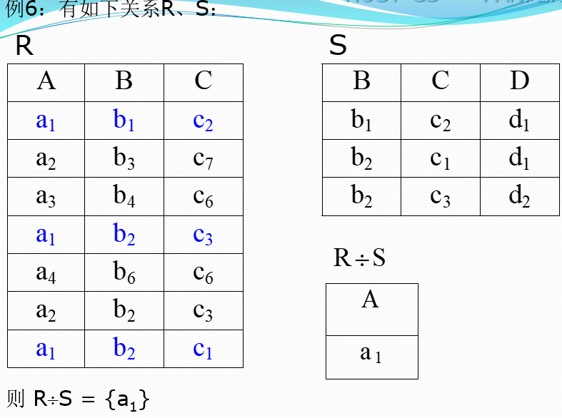


！！！！！！
这里需要会做题，主要是写关系代数和会计算即可。
### 三、SQL

#### SQL概述和特点
SQL的三级模式示意图：简单易懂
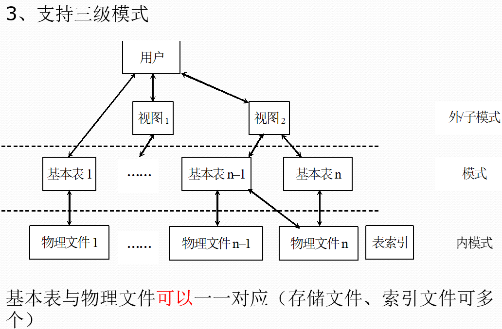
#### 基本SQL语句


例子：创建关系“教室表”，拥有属性：“教室编号、教室名称、教学楼编号、教室容量、教室资源配置、使用对象类型”。
```sql
# create
CREATE TABLE [dbo].[classroom] (
	[rmno] [char] (5) NOT NULL PRIMARY KEY,
	[rmtitle] [varchar] (30) NULL ,
	[buildno] [char] (4) NOT NULL ,
	[quantity] [int] NOT NULL ,
	[resource] [char] (2) NOT NULL ,
	[usertype] [char] (2) NULL 
	) 

# alter
ALTER Table car
add [emission] [float]  NOT NULL; 

ALTER TABLE dbo.classroom
DROP COLUMN isopen, isused;

# 字符匹配
LIKE 通配符%
```
#### 索引结构（B和B+树）以及B+树优化
这个我熟，如果读者需要的话自己去看看吧。
建立索引：针对学生关系STU的学号属性SNO建立索引

```sql
    CREATE INDEX IND_STU ON STU(SNO);

    # 建立唯一性索引的话，在INDEX前加上UNIquE
```
#### ！！单表查询、多表查询、嵌套查询！！

#### 数据更新、删除等操作

#### 视图操作

### 四、数据库安全性

#### 基本原理

三类安全性问题：技术安全、管理安全、政策法律

#### 具体安全控制机制

##### 存取访问控制

用户权限定义、用户权限检查

##### 自主存取控制、强制存取控制

简单来说，就是在访问数据库时，先要通过用户认证确定你有多大的权限，之后才能按照强制存取控制来实现权限控制。
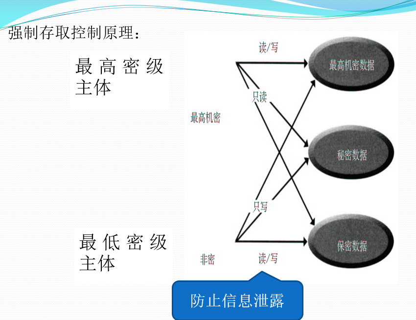
##### 系统设计原则：

较高级别的数据保护要包含较低级别的所有保护。

### 五、数据库完整性

#### 实体完整性

——对关系模式主属性施加的完整性控制。
 
**不允许空，在关系中取值唯一。** 例： student (SNO,SNAME,SEX,BYEAR)	，SNO不能为空且唯一；course(CNO,CTITLE)，	CNO不能为空且唯一；sc(SNO,CNO,GRADE)   ，(SNO，CNO)不能为空。


#### ！！参照完整性！！
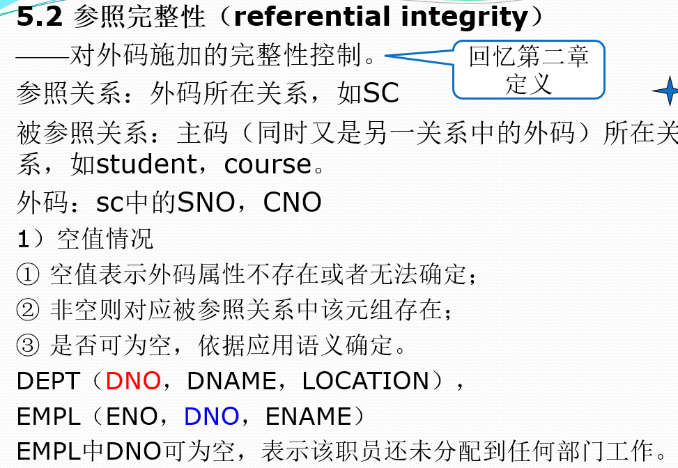
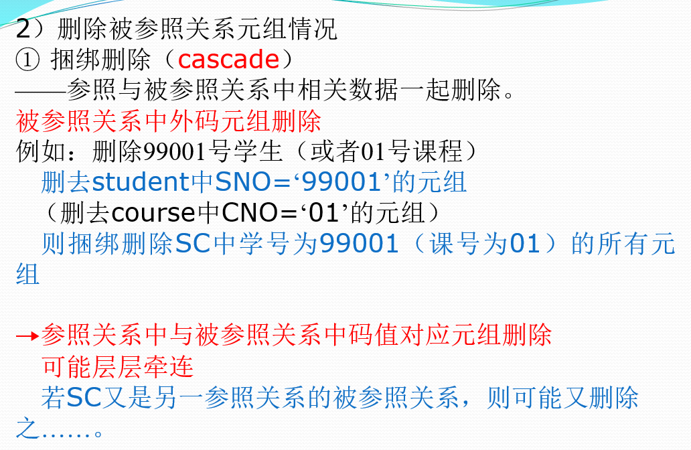
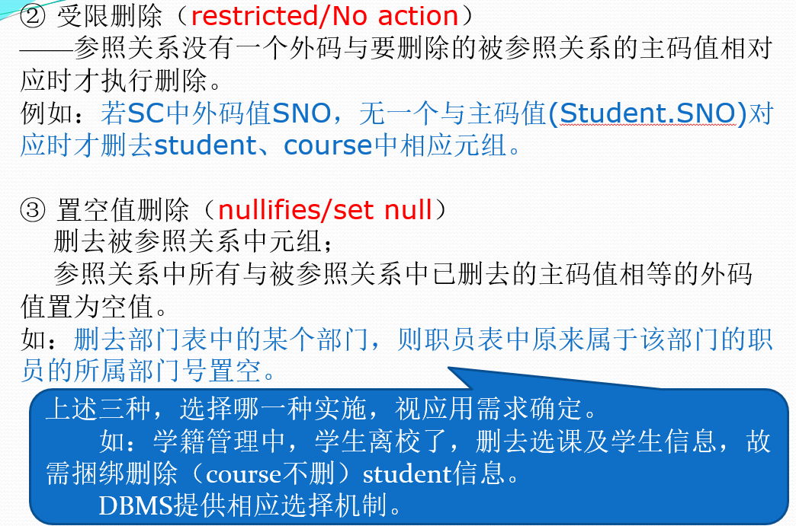
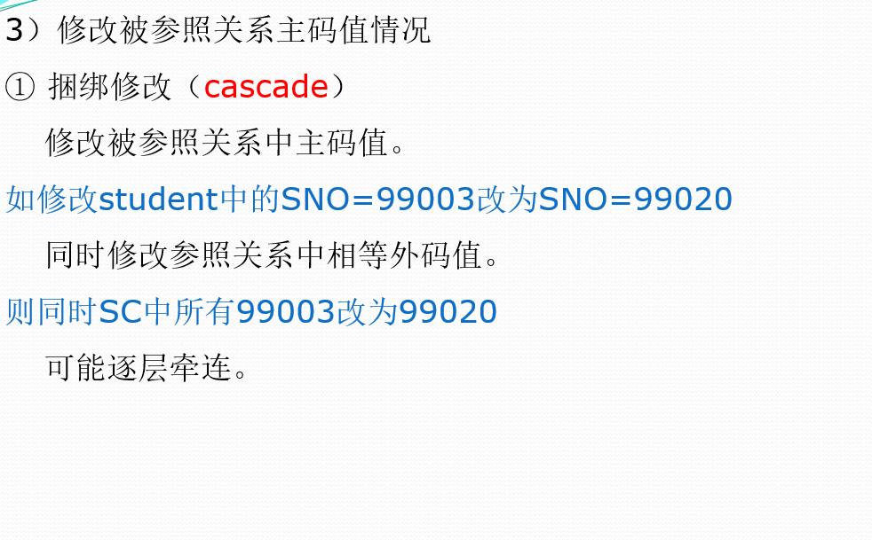
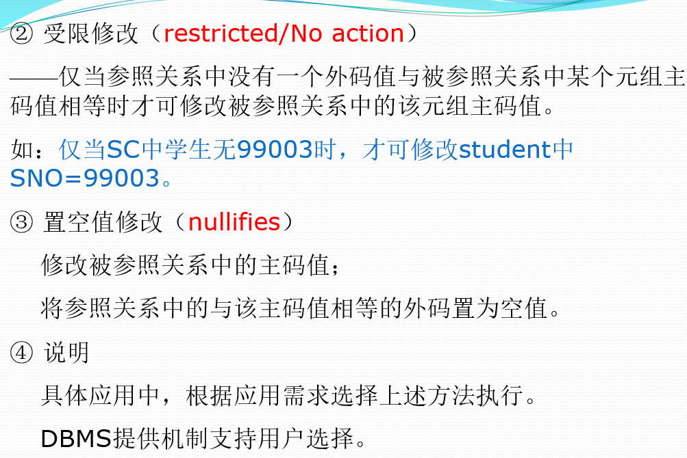
<!-- 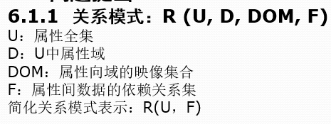 -->
#### 用户定义完整性

这是用户自己定义的对数据的种种限制，与数据本身的属性有关。
#### 断言

#### ！！触发器！！

触发器相当于绑定在某些数据库操作上的行为，比如插入某条满足一定条件的数据后对数据进行某种处理和转换。

### 六、关系数据理论（范式等）重点难点！

#### ！！各种范式的概念及其前置概念！！


**码（候选码）：**
码的形式化定义

定义：设有关系模式R(U，F)，X为U的子集，若   

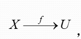，

则x为R的一个候选码(Candidate Key)。

也就是说，U完全函数依赖于X。这个X可以有很多个。

**主属性：**

定义：属于任何一个候选码中的属性称为主属性。主属性是比候选码中的属性多得多的。不属于任何候选码中的属性称为非主属性。

**主码：**
任意候选码之一。整个属性组是码，则称为全码。


##### 为什么要引入规范化和范式？

	1.一个好的关系模式应冗余尽可能少；
	2.一个好的关系模式应避免插入、删除异常；
	3.原因是关系模式中存在不合适的属性间联系；
	4.解决方法是消去不合适联系；
	5.采用分解的策略消去。

##### 函数依赖概念：

(任给一x，有唯一y与之对应，则x->y)

平凡函数依赖、非平凡函数依赖：区别：平凡函数依赖中x是y的子集，这件事是很平凡的，很正常的。所以称为平凡函数依赖。

完全函数依赖、部分函数依赖：区别在于完全函数依赖中x是不可再分的，即x的子集不再满足x->y的性质。


重要概念：各级范式之间的进步（递进）关系。
#### 各级范式（1-BC）NF

**1NF：**

特点：任给关系模式R（U，F），若U中每个属性**均为不可再分**的基本数据元素（原子项），则R∈1NF。关系数据库系统中，所有关系模式都必须是1NF。

问题：非主属性部分fd于候选码（可能是候选码的子集决定非主属性）。可能存在冗余，修改麻烦，操作异常问题。

**2NF：**

特点：任给R（U，F），若R∈1NF，且每个非主属性都
完全函数依赖于候选码（不能是部分函数依赖！），则R∈2NF。

换言之：2NF不允许F中有这样的函数依赖“X->Y”,其中X是码的真子集，Y是非主属性。（X不能是码的真子集）

**3NF：**
特点：任给R（U，F），若不存在这样的码X、属性组Y及非主属性Z（Z不包含于Y），使得X —> Y，（Y—/>X）， Y —> Z成立，则R∈3NF。

任给R（U，F），若R为2NF，且其每一个非主属性都不传递fd于候选码，则R∈3NF。

理解：3NF不允许F中有这样的非平凡函数依赖“X —> Y”，其中X不包含码，Y是非主属性。(X中必须含有码)

**BCNF：**

1、定义

任给R（U，F），X、Y为U中属性子集，若R∈1NF，且对R的每一个X->Y，Y ⊈ X，X必包含侯选码，则R∈BCNF。（任何除候选码及其真子集以外的属性集合都由候选码决定，取消了Y是非主属性的限制。）

若R中的每一个函数依赖中的左部决定属性集都包含有候选码，则R∈BCNF。

2、BCNF性质

1）所有非主属性都完全函数依赖于候选码；（2NF）
2）所有非主属性都不传递函数依赖于候选码；（3NF）
3）所有主属性都完全函数依赖于不包含它的候选码；
4）所有主属性都不传递函数依赖于候选KEY。 没有任何属性函数依赖于非码的任何一组属性。

**一图总结：**
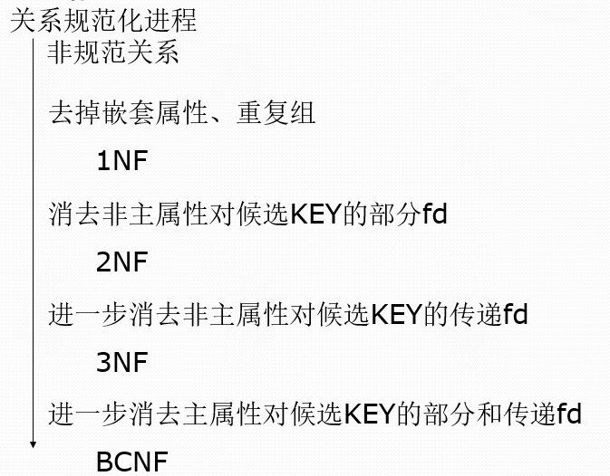


#### ！！公理系统及推导证明！！

##### 几个规则：

自反律（包含）、增广律（“乘”）、传递律。


###### 计算属性闭包：
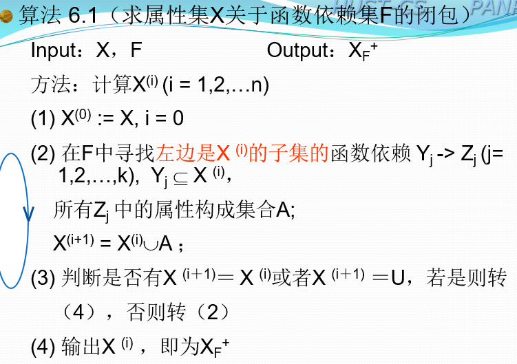

##### 求解候选码：
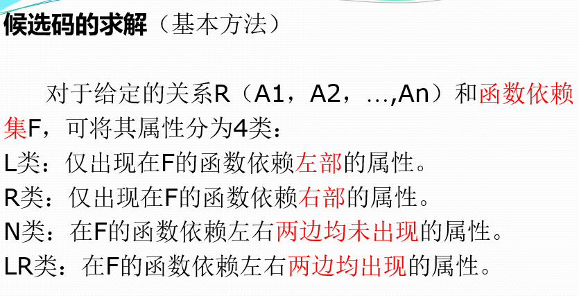

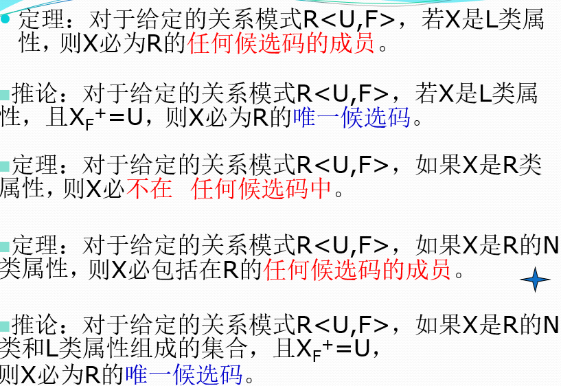

判断两个函数依赖集等价的方法：逐一判断F和G中的函数依赖XY是否能由对方导出。

#### 最小依赖集问题
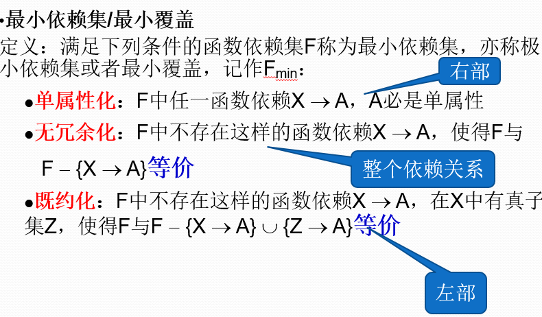

无冗余化：不存在两个能相互到处的互补子集；

##### 求最小依赖集算法：
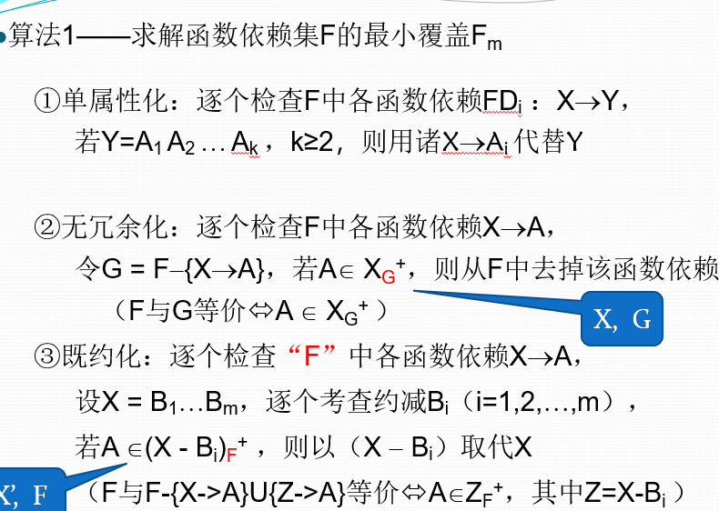

减掉其中一个，看看还能不能推的出来。
#### 两种模式分解算法

##### 分解正确性：
分解具有无损连接性
定义：任给R（U、F），r={R1，R2…，Rn}是R的一个分解，若对R的任一满足F的关系r都有： 
r=πR1（r）⋈ πR2（r）⋈ …… ⋈ πRn（r）
则称是R满足F的一个无损连接分解。

**这段定义看起来复杂，其实意思就是说连接起来还能得到原来那张表就行！**

##### 无损连接检验算法：

### 七、数据库设计（软件工程相关理论）

这一章主要就是做题，另外，要关注E-R图转关系模式的方法。

#### ！！E-R图！！

#### ！！关系模式！！

### 八、关系数据库引擎基础（参考CMU）

#### 数据库存储

这一章的知识挺有用的。。。但是貌似不考，很符合我对口口的印象。			

页及其堆文件组织：


#### 缓存（缓冲池）

#### 散列表

#### 查询处理


### 九、关系查询处理和查询优化

#### 查询处理步骤


##### 各种运算的实现方法：
选择运算的实现方法（参见课件第8章）：

     全表扫描

     索引扫描

连接运算的实现方法：

    嵌套循环连接（nested loop）
	
	排序—合并连接（sort-merge join）

    Hash连接（hash join）

    索引连接（index join）

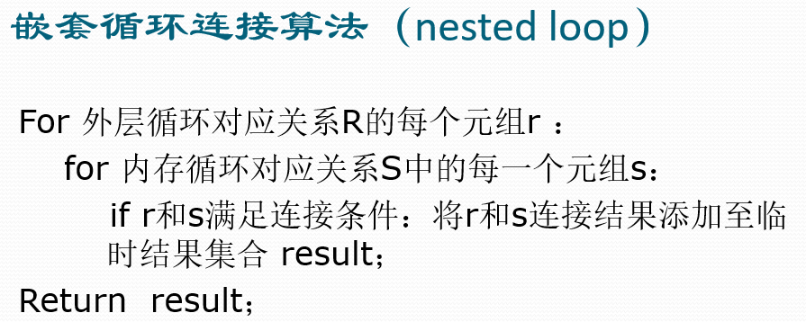

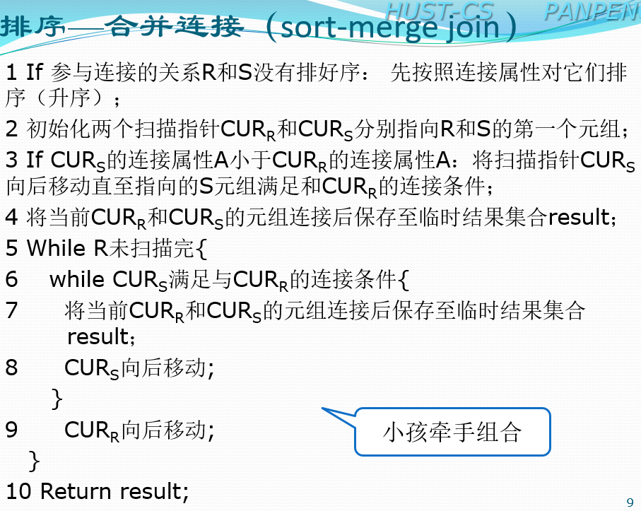

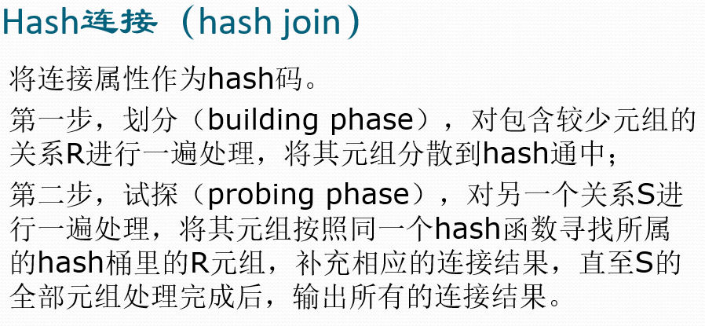

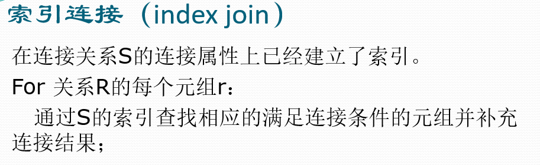


查询优化的任务：提高速度（DBMS）

具体目标：1、减少中间关系规模2、减少I/O

#### 举例说明不同SQL语句的性能差异：
见PPT15页-20页

读取->写出->做选择->做投影

#### 代数优化
**连接/笛卡尔积的交换律**

**连接/笛卡尔积的结合律**

**投影的串接律**

**选择的串接律：选择条件可以合并，一次可检查全部条件。**

**选择与投影的交换律**

**选择与笛卡尔积的交换律：部分选择在笛卡尔积前先做。**

**选择与并、差、自然连接的分配律**

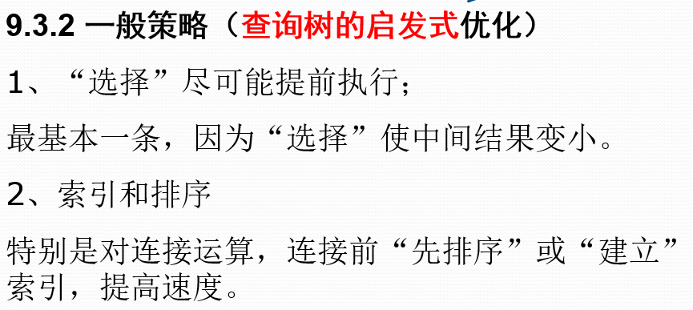


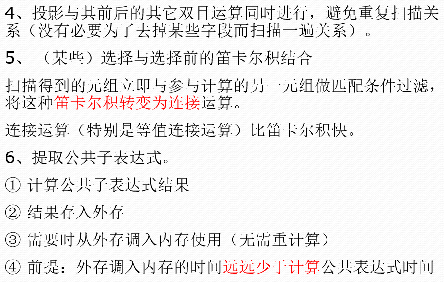

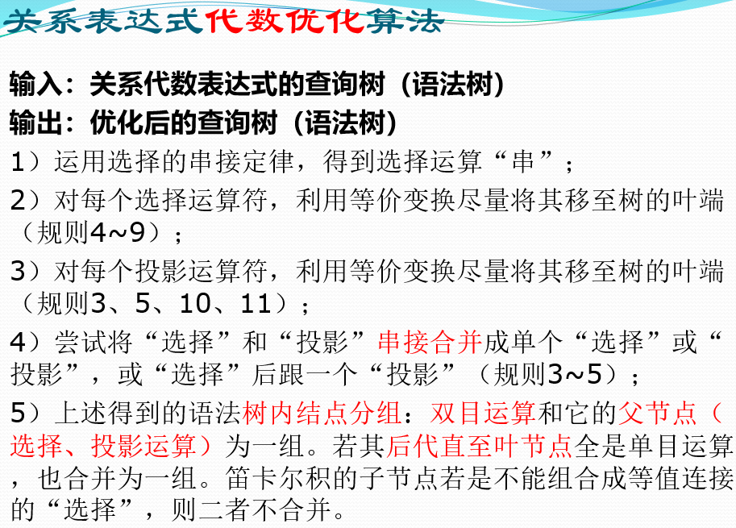
#### 物理优化

常常先使用启发式规则选取若干较优的候选查询方案，然后分别估算这些候选方案的执行代价，从而选取代价最小的作为执行计划。

总代价＝I/O代价＋CPU代价＋内存代价＋通信代价

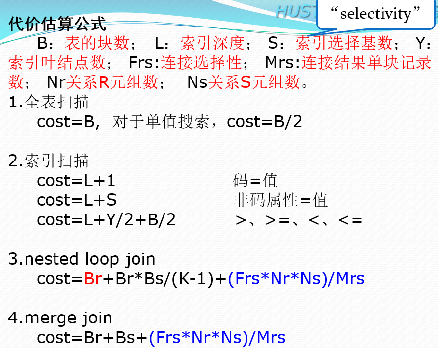
**查询优化的过程：**
查询树经过变形后得到**语法树**，
然后根据**代数优化**的启发式规则对语法树进行逻辑优化，
再考虑存取路径、底层操作算法的不同，根据**物理操作**的启发式规则提出多种查询计划，
然后可根据某种**代价模型**评估这些查询计划的执行代价，从中选取评估结果最小的作为执行计划。

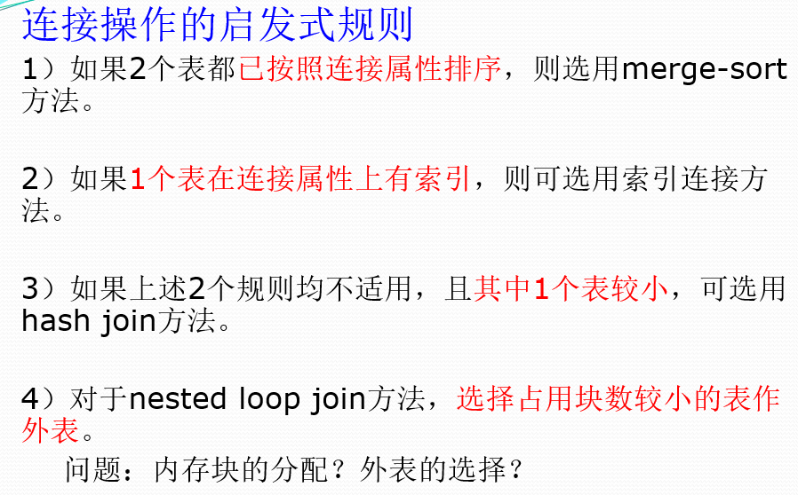

<!-- 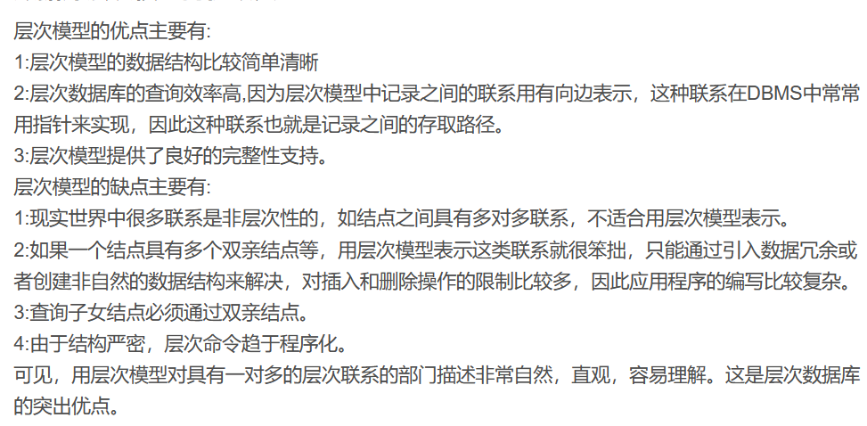 -->
### 十、数据库恢复技术
#### 系统故障后的REDO和UNDO恢复
#### 检查点机制
### 十一、并发控制

#### 可串行化调度
