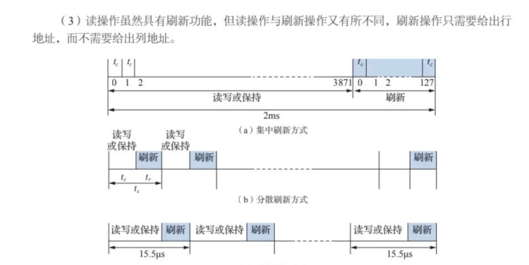
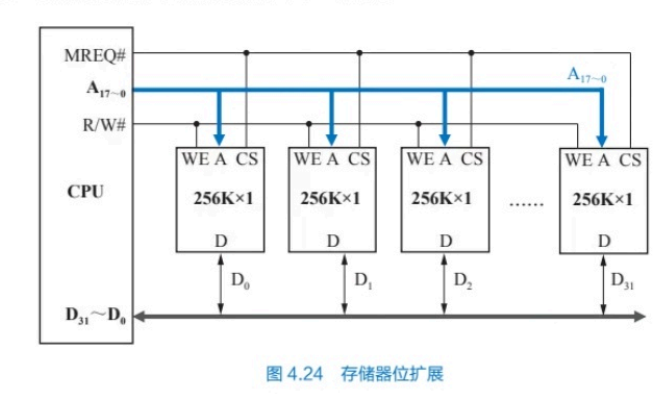
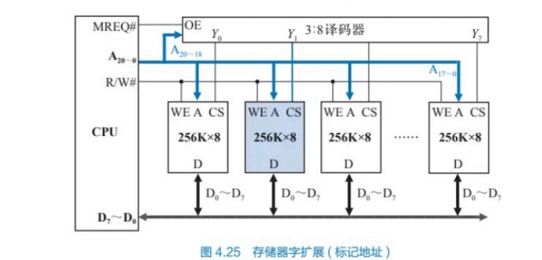
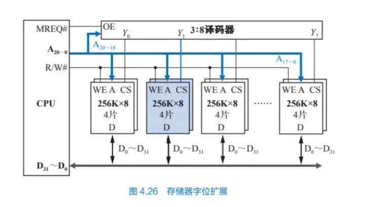

### 本blog是复习组成原理部分的一些知识，主要包括存储器和中央计算器。请参考华中科技大学组成原理教材-《计算机组成原理》，谭志虎。

## 信息校验（三）

### 码距校验

### 海明校验

### 循环冗余校验

### 浮点数，定点数表示（数值数据表示）

### 非数值数据表示

## 运算方法与运算器（五）

### 定点运算
#### 定点加减法运算
#### 定点乘法运算
#### 定点除法运算

## 存储系统（七）
### 存储器概述

#### 存储容量
- 位表示法
- 字节表示法

#### 存储字长和数据字长：
存储字长：主存的一个存储单元存储的二进制位数

数据字长（简称字长）：一次处理的二进制数位数。

数据字长相同的计算机，存储字长可以不同

#### 地址访问模式：
- 字节地址
- 半字地址
- 字地址，倍数运算关系
#### 大小端：
小段：低地址存放低字节

大端：反之
### 主存

半导体存储器：RAM和ROM

#### 静态MOS处理器：
存储1个二进制位信息。

##### 6管MOS存储元：
T1、T2工作管。T3、T4负载管。T5T6门控管。

T1、T2一个截止，一个导通，一高一低，形成一个电位。

#### 单管MOS存储元：
利用存储电容是否带电来表示数据，**行刷新**
##### 刷新机制
- 集中刷新
- 分散刷新
- 异步刷新

**用一个电源供电，防止数据丢失**

### 存储器扩展
#### 位扩展（子长扩展，数据总线扩展）
如存储器是256x1bit，CPU是32bit，这时候需要32个存储器连在一起。

#### 字扩展
存储芯片容量不够，把多个位数和CPU位数相同的存储器串起来来扩大容量。

#### 同时扩展：
上面两个杂交

### 缓存
##### 写分配法：
未命中时是否要把数据从主存读到高速缓存
##### 全相联
##### 直接相联
##### 组相联

#### cache相关计算
##### cache的实际大小：
- 全相联： **n x (1 + s + 8 x 2(^w))**
- 直接相联：**cache行号i=主存块号j mod n**

s和w分别是主存的块地址和块内偏移。n是缓存行数。

### 虚拟存储

## 指令系统（八）

### 格式

### 寻址方式

### 指令类型

## 中央处理器（九）
### 指令周期
### 数据通路

状态（寄存器）->数据处理->状态（寄存器）
#### 数据处理单元（算）
#### 状态存储单元（存）

### 时序与控制

### 硬布线

### 微程序