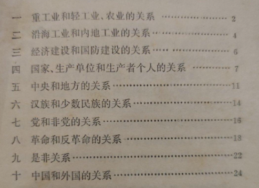

### 本blog是复习毛概考试的知识点总结。
# 架构：
- 毛泽东著作年表
- global cache
- 毛概复习方法
- 毛概各章节知识点回顾（分为单选类知识点和多选类知识点）

## 毛泽东著作年表
https://www.bilibili.com/read/cv13703743
## global cache 

### 四大理论解决的主要问题
- 毛泽东：什么是马克思主义，怎样对待马克思主义。
- 邓小平：什么是社会主义，怎样建设社会主义
- 江泽民：建设怎样的党，怎样建设党
- 胡锦涛：实现什么样的发展，怎样发展

### 活的灵魂
- 马克思主义活的灵魂：解放思想、实事求是、与时俱进
- 毛泽东思想活的灵魂：实事求是、群众路线和独立自主（1982）
- 邓小平理论活的灵魂：解放思想、实事求是

### 马列主义和中国具体实际结合：
- 第一次结合：民主革命时期，探索中国的革命道路
- 第二次结合：建国后，找到适合中国特点的社会主义建设道路

## 毛概复习方法和资料总结：

### 华科毛概考试：主要难度在于把握住单选题和多选题。
华科思政考试的特点：思维上特别困难的题目，几乎不会有。但是选择题喜欢去教材上找一些极其偏僻和冷门的概念。这要求我们如果想拿高分，必须要回去看教材。

看教材时，特别主义那些性质判断类型的文字。比如“  ”是“  ”的前提基础。这种会出单选。还需要在意有两到四个分论点的内容，会被拿来出多选题。

利用资料复习：高教中心思维导图能够解决90%的问题。剩下的问题需要回归课本。其他资料：学解上收录的题目有的太偏（而且内容太多了），只需要看那些概念性内容；高教中心的习题集都是白痴题，建议当成填空题复习；**华科教研室给的练习题是最最重要的训练集，必须全部记牢；**华科刘老师的自测题：内容少，值得一刷。

## 导论
 
##### 1、马克思主义中国化这一命题的正式提出：

1938 六届六中全会 毛泽东《论新阶段》“没有抽象的mks主义，只有具体的马克思主义”。

##### 2、指出毛泽东思想是“中国化的马克思主义”：
1945 党的七大 刘少奇《关于修改党章的报告》

##### 3、阐释马克思主义中国化时代化的重大历史意义：
2021年，十九届六中全会《第三个决议》

##### 4、提出继续推进马克思主义中国化时代化的新要求：
2022 二十大

##### 5、马克思主义理论本身发展的内在需求和解决中国问题的客观需要：推进马克思主义中国化时代化

##### 马克思主义中国化时代化新的飞跃的时间：
改革开放和社会主义现代化建设时期

***#######f#########e########n########c#######e#######***

### 马克思主义中国化的内涵：

三层意思

## 毛泽东思想及其历史地位（一）

##### 19世纪20年代的时代主题：战争和革命

##### 毛泽东思想形成和发展的实践基础：
中国共产党领导人民进行革命和建设的成功实践

#### 毛泽东思想形成发展

##### 毛泽东思想开始萌芽：新民主主义革命基本思想的提出：

《中国社会各阶级的分析》《湖南农民运动考察报告》

##### 中国革命具有决定意义的新起点：
从进攻大城市转为向农村进军。

##### 毛泽东思想初步形成，指出中国革命发展规律：
毛泽东提出并深入阐述的农村包围城市，武装夺取政权的思想

##### 八七会议：
确定实行**土地革命和武装起义**的方针

##### 遵义会议：伟大转折意义
事实上确立毛泽东领导地位，开始确定正确路线在党中央的领导地位，开始形成第一代领导集体，开启了党自主解决中国革命实际问题的新阶段。

##### 第一次历史决议：
六届七中全会

##### 标志着毛泽东思想确立为党必须长期坚持的指导思想：1945 七大党章

### 新民主义革命理论：
第二次结合

##### 建立共和国，确立社会主义基本制度，建立完整工业体系

##### 文革后两种错误倾向

***#######f#########e########n########c#######e#######***

#### 三大法宝（3）：
统一战线，武装斗争、党的建设

##### 科学阐述新民主主义革命，历史性飞跃，趋于成熟（5）：
《共产党人发刊词》《中国革命和中国共产党》《新民主主义论》《改造我们的学习》《论联合政府》

**“认识了中国这个客观世界”**

##### 毛泽东思想的丰富和发展，关于社会主义革命和社会主义建设的重要思想（4）：
《七届中央委员会二次全体会议上的报告》《论人民民主专政》《论十大关系》《关于正确处理人民内部矛盾的问题》

##### 指出中国革命农村包围城市的规律（4）：
《中国的红色政权为什么能存在》《井冈山的斗争》《星星之火可以燎原》《反对本本主义》

### 毛泽东思想的主要内容：
#### 新民主主义革命理论：
##### 中国资产阶级有两个部分：
##### 中国革命只能以长期武装斗争为主要形式
#### 社会主义革命和社会主义建设理论：
##### 两个阶段
- 后一个阶段可能更长，艰难性、复杂性、长期性
#### 革命军队建设和军事战略的理论：
##### 新型人民军队（3）：
- 无产阶级性质
- 具有严格纪律
- 同人民群众保持亲密联系
##### 党对军队的绝对领导原则
##### 三大民主：
政治经济军事
##### 三大原则：
官兵一致、军民一致、瓦解敌军
##### 建设人民军队的思想（4）：
- 以人民军队为骨干
- 依靠广大人民群众
- 建立农村根据地
- 进行人民战争
#### 政策和策略：
极端重要，**党的生命**
##### 两个条件：
坚决斗争取得胜利和给被领导者物质利益。
#### 思想政治和文化工作：
##### 团结全党进行伟大政治斗争的中心环节：
掌握思想教育
##### 经济工作和其他一切工作的生命线：
思想政治工作，三个方针：
- 政治和经济统一
- 政治和技术统一
- 又红又专
#### 党的建设
##### 区别于其他任何政党的显著标志：
- 理论和实践相结合作风
- 和人民群众紧密联系在一起的作风
- 自我批评的作风
### 毛泽东思想活的灵魂：
#### 实事求是：
1937 实践论矛盾论

1938 六届六中全会

**毛泽东思想的基本点和精髓，认识世界改造世界的根本要求，中国共产党人的根本路线**
##### 坚持实事求是（3）：
- 深入了解事务本来面貌
- 清醒认识和正确把握我国国情
- 不断推进实践基础上的理论创新。
##### 群众路线（3）
- 坚持人民是推动历史发展的根本力量
- 坚持全心全意为人民服务
- 保持党同人民群众的血肉联系
#### 独立自主
**独立自主是中华民族优良传统，是立党立国的重要原则，是必然结论**
##### 独立自主要（3）：
- 坚持中国的事情必须中国人民自己做主
- 坚持独立自主的外交政策
- 中华民族精神之魂

##### 毛泽思想历史地位：
- 第一个重大理论成果
- 革命和建设的科学指南
- 宝贵的精神财富
 

## 新民主主义革命理论（二）

##### 解决中国问题的基本前提：
认清中国国情

##### 近代中国最基本的国情：
由于西方列强入侵和封建统治腐败，中国逐步称为半殖民地半封建社会。

##### 什么决定了中国革命仍然是资产阶级民主革命：
近代中国的社会性质和主要矛盾

##### 中国无产阶级作为独立的政治力量登上历史舞台的标志：
五四运动

##### 中国革命分两步走：
1、完成反帝反封建的新民主主义任务；

2、完成社会主义革命任务。

##### 革命理论形成的实践基础：
新民主主义革命的艰辛探索，革命斗争正反两方面实践经验

##### 革命的首要问题：
分清敌友

##### 首次提出：
1939《中国革命和中国共产党》

##### 完整总结和概括：
1948 在晋绥干部会议上的讲话

##### 新民主主义革命的总路线：
新民主主义革命的**对象**：帝国主义、封建主义和官僚资本主义。首要革命对象：帝国主义。帝国主义统治中国和封建军阀进行专制统治的社会基础：封建地主阶级。**在不同的历史阶段，革命的主要对象有所不同。北洋军阀-》国民党新军阀-》日本帝国主义-》美帝国主义支持下的国民党反动派**

新民主主义革命的**动力**：无产阶级、农民阶级、城市小资产阶级、民族资产阶级。**中国革命最基本的动力：无产阶级。中国革命的主力军：农民。**新民主主义革命实质上就是党领导下的农民革命。可靠同盟者：城市小资产阶级。民族资产阶级：两面性。

新民主主义革命的**领导力量**，中国革命的中心问题，新民主主义革命理论的核心问题：**无产阶级的领导权**。中国无产阶级的独特优点：遭受三重压迫；集中分布在大城市和企业；成员大多数出身破产农民，和农民有天然联系。

坚持领导权的基本策略：坚持独立自主，又联合又斗争

保证领导权的坚强支柱：建立强大的革命武装

实现领导权的根本保证：加强无产阶级政党的建设

新民主主义革命的**性质和前途**：不是无产阶级社会革命，而是资产阶级民主主义革命。

##### 区别新旧民主主义革命的根本标志：
革命领导权在无产阶级手中还是资产阶级手中

##### 革命的根本问题：
政权问题

##### 新民主主义国家制度的核心内容和基本准则：
人民当家做主，由人民行使管理国家的一切权力

##### 国体，政体
国体：各革命阶级联合专政

政体：民主集中制的人民代表大会制度

#### 经济

##### 新民主主义革命的主要内容：
没收封建地主的土地归农民所有

##### 题中应有之义：
没收官僚资本归新民主主义国家所有

#### 文化

## 新民主主义革命的道路和基本经验

##### 道路：
农村包围城市，武装夺取政权的革命道路。

##### 新民主主义革命道路的提出：
《中国的红色政权为什么能存在》《井冈山的斗争》《星星之火可以燎原》：工农武装割据；1938.11 六届六中全会

##### 走革命道路的根本：
处理好土地革命，武装斗争、农村革命根据地建设三者之间的关系。

统一战线是由什么决定的

##### 中国革命的特点和优点之一：
武装斗争。

##### 党内思想上的主要矛盾：无产阶级思想和非无产阶级思想之间的矛盾。

***#######f#########e########n########c#######e#######***

##### 中国革命的两个基本特点：统一战线和武装斗争。

##### 三大法宝（《共产党人发刊词》）：
统一战线、武装斗争、党的建设

##### 无产阶级的共性优点（3）：
- 与先进的生产方式相联系
- 没有私人占有的生产材料
- 富于组织纪律性

##### 中国无产阶级的独特优点（3）：
- 受到三重压迫
- 集中分布
- 大部分出身破产农民，天然联系

### 新民主主义的基本纲领

#### 政治
建立新民主主义共和国

##### 新民主主义国家制度的核心内容和基本准则：
人民当家作主

#### 经济
- 没收封建地主土地（主要内容）
- 没收官僚资本（题中之义）
- 保护民族工商业（极具特色）

#### 文化
**反帝反封建，民族的科学的大众的文化**

### 三大法宝：
#### 统一战线：
**重要内容**
- 阶级状况
- 中国革命的长期性残酷性
- 诸多矛盾交织
##### 两个同盟
##### 实践经验：
- 建立巩固的工农联盟
- 正确对待资产阶级
- 区别对待
- 坚持独立自主原则
#### 武装斗争：
**中国革命的特点和优点之一**
##### 武装斗争经验（4）：
- 坚持党对军队绝对领导
- 建设全心全意为人民服务的人民军队
- 开展革命的政治工作
- 坚持正确的战略战术原则
#### 党的建设：
取得胜利的要求
##### 党的建设经验：
- 思想建设首位
- 重视组织建设
- 重视作风建设
- 联系党的政治路线
## 社会主义改造理论和初步探索理论（三四）：

新民主主义社会：过渡性。

##### 土地改革基本完成后我国社会的主要矛盾：
工人阶级和资产阶级的矛盾，民族资产阶级依然具有两面性。

### 总路线
一化三改：社会主义工业化，对个体农业、手工业和资本主义工商业的社会主义改造。

一化是主体，三改是两翼。

**同时并举**

##### 国家资本主义：
私人资本主义经济向社会主义国营经济过渡的形式

##### 1951共识：
用三个五年计划时间搞工业化建设，再向社会主义过渡的共识。

##### 1952国民经济得以恢复

##### 提出中国逐步过渡到社会主义的指导方针：
1952.9，毛泽东，现在就用10-15年过渡

##### 过渡时期总路线
1953.6-12
1954.2 党的四中全会，正式批准这条总路线

#### 1954.9 第一届全国人大
《中华人民共和国宪法》，明确规定了人民民主专政的国体和人民代表大会制度（根本政治制度）的政体。

##### 1956 
全行业公私合营进入高潮，标志对资本主义工商业改造完成

##### 1956年底
农业手工业完成

##### 社会主义基本制度基本确立，进入社会主义初级阶段
1956年底

##### 调动一切积极因素为社会主义事业服务：
1956 中央政治局扩大会议 《论十大关系》，**初步总结我国社会主义建设经验，提出以苏为鉴，独立自主地探索适合中国情况的社会主义建设道路。**

基本方针：努力把党内党外一切积极因素调动起来

根本思想：根据本国情况走自己的道路

**标志着党探索中国特色社会主义建设的良好开端**

##### 十大关系：

### 系统论述社会主义社会矛盾
1957.2 《关于正确处理人民内部矛盾的问题》
##### 基本矛盾
生产力和生产关系、上层建筑和经济基础

##### 党和国家工作重点转移：
技术革命和社会主义建设，要求各级党委抓社会主义建设工作，全党学科学、技术、新本领。

##### 中国历史上最深刻最伟大的历史变革：
社会主义基本制度的确立

##### 两类不同性质的矛盾：
人民内部矛盾（分清是非）和敌我矛盾（分清敌我）。

民族资产阶级和工人阶级是内部矛盾。

##### 主要矛盾：不能满足

##### 正确处理人民内部矛盾的总方针：
用民主的办法解决。

##### 国民经济总方针：
农业为基础，工业为主导，农轻重为序，“两条腿走路”

##### 四个现代化：
第一次提出：1954，周恩来，一届全国人大一次会议

1957 毛泽东提出建设工、农、科学文化的社会主义国家

1959 毛泽东加上国防现代化

1964年底，**正式宣布**建设成一个具有现代农业、现代工业、现代国防和现代科学技术的社会主义强国。

第一步：第三个五年计划开始建立工业体系

第二步：实现四个现代化

***#######f#########e########n########c#######e#######***

##### 新民主主义要继续发展（2）：
- 不断扩大国营经济
- 逐步将资本主义经济和个体经济改变为社会主义经济 

##### 新民主主义的经济成分（5）：
社会主义性质的国营经济、半社会主义性质的合作社经济、农民和手工业者的个体经济、私人资本主义经济和国家资本主义经济。

##### 主要的经济成分（3）：
社会主义经济、个体经济和资本主义经济。

##### 中国社会的阶级构成主要是（三种基本的阶级力量）（3）：
工人阶级、农民阶级和其他小资产阶级、民族资产阶级。

##### 两个转变并举（2）：
**七届二中全会**：
- 稳步地由农业国转变为工业国
- 由新民主主义国家转变为资本主义国家

##### 总路线体现（2）：
- 社会主义工业化和社会主义改造的紧密结合
- 解放生产力与发展生产力、变革生产关系和发展生产力的有机统一

##### 马克思恩格式曾设想过的改造方式（2）：
暴力没收和和平赎买，列宁也曾设想和平赎买

##### 为什么需要过渡时期（2）：
- 经济文化落后，需要时间创造前提
- 广大的农业手工业，占大比重的资本主义工商业

##### 农业改造（4）：
- **农业是三大改造中首先进行的**

1、积极引导农民组织起来，走互助合作道路。积极性：互助合作和个体经济

2、遵行自愿互利、典型示范和国家帮助原则，以互助合作
的优越性吸引农民走互助合作道路。

3、正确分析农村的阶级和阶层状况，制定正确的阶级政策：**依靠贫下中农，发展互助合作，由逐步限制到最后取消富农剥削**

4、坚持积极领导，稳步前进的方针，采取循序渐进的步骤。**互助组（社会主义萌芽），初级社（半社会主义），高级社（社会主义性质）三个阶段**

##### 手工业改造（3）：
- 方针：积极领导，稳步前进，方法上从供销合作入手

1、办手工业促销小组（组织个体劳动则，**社会主义萌芽**）

2、办手工业促销合作社（部分生产资料公有，**半社会主义**）

3、建立手工业生产合作社（社会主义集体所有制）

##### 资本主义工商业（3）
- 和平赎买（**国家有偿地将私营企业改变为国营企业**）的办法，不是花钱买，而是资本家在一定年限内获得一部分利润。
- 从低级到高级的国家资本主义的过渡形式
- 把资本主义工商业者改造为自食其力的社会主义劳动者

##### 资本主义工商业改造步骤（3）：
- 实行初级形式的国家资本主义 **四马分肥**
- 实行个别企业的公私合营
- 实现全行业的公私合营

##### 和平赎买有利于（3或4）
- 对资本主义工商业实行和平赎买，有利于发挥私营工商业在国计民生方面的积极作用，促进国民经济的发展；
- 有利于争取和团结民族资产阶级，有利于团结各民主党派和各界爱国民主人士，巩固和发展统一战线；
- 有利于发挥民族资产阶级中大多数人的知识、才能、技术专长和管理经验，也有利于争取和团结那些原来同资产阶级相联系的知识分子为社会主义建设服务。

##### 和平赎买的可能性（4）

　　首先，民族资产阶级具有两面性。

　　其次，中国共产党与民族资产阶级长期保持着统一战线的关系，这就将工人阶级和民族资产阶级之间的对抗性矛盾转化为非对抗性的矛盾并按照人民内部矛盾来处理提供了前提。

　　再次，我国已经有了以工人阶级为领导、工农联盟为基础的人民民主专政的国家政权，建立了强大的社会主义国营经济并掌握了国家的经济命脉，这就造成了私人资本主义在政治上、经济上对社会主义的依赖。

　　再加上当时国家对粮食和工业原料的统购统销，以及资本主义企业中工人群众对资本家的监督等因素，这样，就使私人资本主义企业只能接受社会主义改造。

##### 初级国家资本主义（4）：
委托加工、计划订货、统购包销、经销代销等

##### 高级国家资本主义（2）：
个别行业的公私合营和全行业的公私合营

##### 中国工业化道路问题（2）：
《论十大关系》：第一大关系，重工业轻工业和农业的关系

《关于正确处理人民内部矛盾的问题》：明确提出了中国工业化道路的问题，明确指出要走一条有别于苏联的中国工业化道路。

毛泽东提出了以工业为基础，以农业为主导，以农轻重为序发展国民经济的总方针。

##### 社会主义改造（1953全面开始）的历史经验（3）：
- 边化边改
- 积极引导逐步过渡
- 和平方法进行改造

##### 社会主义基本制度的确立（公有制）（4）：
- 社会经济结构发生根本变化
- **全民所有制和劳动群众集体所有制这两种**经济成分占绝对优势
- 公有制成为经济基础
- 标志着中国历史上长达数千年的阶级剥削制度的结束和社会主义基本制度的确立。

##### 阶级关系根本变化：
- 帝国主义 驱逐
- 官僚资产阶级 消灭
- 地主富农 改造中
- 工人阶级 成为领导阶级
- 农民 集体劳动者
- 知识界 成为为社会主义服务的队伍

广大劳动人民成为主人

##### 专政（对待敌我）（4）：
- 依法治罪
- 剥夺政治权利
- 强迫劳动
- 改造成为新人

##### 民主（对待内部）（3）：
- 讨论
- 批评
- 说服教育

### 内部矛盾处理：
- 政治思想领域：团结-批评-团结

- 物质利益和分配：统筹兼顾，适当安排，**兼顾国家、集体和个人三个方面的利益**

- 人民群众和政府机关：坚持民主集中制

- 民族之间：民族平等，团结互助

##### 工业四个并举（4）
- 重和轻
- 沿海和内地
- 中央和地方
- 大型和中小型

##### 完善所有制结构（2）
- 毛、刘、周：资本主义经济作为社会主义经济的补充
- 陈云：三个主体（工商业经营，生产计划，统一市场）三个补充

##### 经济体制和运行机制（4）：
- 毛泽东：发展商品生产、利用价值规律
- 刘少奇：社会主义经济既有计划性又有灵活性和多样性
- 陈云：适合我国情况和人民需要的社会主义的市场
- 毛泽东：建立合格的规章制度和严格的责任制，“两参一改三结合”。

##### 社会主义两个阶段（2）：
- 不发达的社会主义
- 比较发达的社会主义

##### 科学教育文化和知识分子工作：
毛泽东：建设工人阶级知识分子队伍

刘少奇：两种劳动制度、两种教育制度

毛泽东：不搞科学技术，生产力就无法提高

周恩来：知识分子中的绝大部分是工人阶级。

##### 三线建设
1964年5月提出。

##### 海峡两岸
周恩来：一纲四目

##### 两个中间地带：
第一个中间地带：亚洲、非洲、拉丁美洲

第二个中间地带：北美加拿大、欧洲、大洋洲、日本

##### 三个世界
第一世界：美苏

第二世界：西方发达国家和东欧国家

第三世界：亚洲非洲拉丁美洲的广大发展中国家

##### 执政党建设：
反对主观主义、宗派主义、官僚主义，批评脱离实际，强调坚持民主集中制和集体领导制度。

**争取中间地带，发展同亚非拉国家的关系**

### 初步探索的意义（3）：
- 巩固和发展了我国的社会主义制度
- 为开创中国特色社会主义提供了宝贵经验、理论准备、物质基础。
- 丰富了科学社会主义的理论和实践。

### 初步探索的经验教训（6）：
- 必须把马克思主义与中国实际相结合，探索符合中国特点的社会主义建设道路
- 必须正确认识社会主义社会的主要矛盾和根本任务，集中力量发展生产力。**八大二次会议错误搞阶级斗争**
- 必须从实际出发进行社会主义建设，不能急于求成。
- 必须发展社会主义民主，健全社会主义法制。
- 坚持民主集中制和集体领导制度。**邓小平：权力过分集中，越来越不能适应社会主义事业的发展。**
- 必须坚持对外开放，不能关起门来搞建设。
## 邓小平理论

##### 基本问题：
什么是社会主义，怎样建设社会主义的问题。

##### 社会主义本质：
解放生产力，发展生产力，消灭剥削，消除两极分化，最终达到共同富裕。

##### 两条根本原则：
一是以社会主义公有制经济为主体，二是共同富裕

## 社会主义初级阶段：十三大

##### 党在社会主义初级阶段的基本路线：
十三大：富强民主文明的社会主义现代化国家

党的十七大：+和谐

党的十九大：+美丽、强国

##### 社会主义的根本任务：
发展生产力

##### 三步走：
- 十三大提出
- 90解决温饱
- 20世纪末小康
- 21世纪中叶：中等发达国家水平，实现现代化

##### 改革开放理论：
改革：社会主义社会发展的直接动力

##### 经济体制改革的核心问题：
如何正确认识和处理计划与市场的关系。

##### 确立建立社会主义市场经济体制的改革目标：
十四大

##### 两手抓两手硬：
物质文明和精神文明

##### 中国问题的关键：党

## 三个代表：

##### 社会主义的根本任务：发展生产力

##### 党站在时代前列、保持先进性的根本体现和根本要求：
始终代表中国先进生产力的发展要求，大力促进生产力的发展。**党的一切方针政策最终都要促进生产力的不断发展。**

##### 社会主义现代化的基础：发达生产力

##### 推动我国先进生产力发展和社会全面进步的根本力量：
广大工人、农民和知识分子。**知识分子是先进生产力的开拓者，在改革开放和现代化建设中有着特殊重要的作用。**

##### 生产力中最活跃的因素：
人，**人才资源是第一资源。**

##### 写入党章：
十六大

##### 党执政兴国的第一要务：
发展

##### 三步走PLUS：
两个一百年目标

##### 党必须履行的重要职责：
大力推动科技进步和创新

##### 第一生产力，先进生产力的集中体现和主要标志：
科学技术

##### 改革开放和现代化建设的重要目标：
社会主义精神文明

##### 发展先进文化极为重要的任务：弘扬民族精神

##### 发展先进文化的重要内容和中心环节：
加强社会主义思想道德建设

##### 发展先进文化的重要任务、经济工作和其他一切工作的生命线：
做好思想政治工作。

##### 一切工作和方针政策的最高衡量标准：
是否符合最广大群众的根本利益。

##### 江泽民：发展是硬道理

##### 中国解决所有问题的关键：
在于依靠自己的发展

##### 重要战略机遇期：
21世纪头十年

##### 改革的根本目的：
改变制度，使生产关系适应生产力的发展

##### 社会主义市场经济体制
- 提出：十四大
- 蓝图和基本框架：十四大三中全会《决定》
- 基本建立了市场经济体制：二十世纪末

##### 股份制：所有权和经营权分离

##### 实现三步走第一步第二步时间：
20世纪末
##### 全面小康提出：
十五届五中全会
##### 阐述全面建设小康社会的奋斗目标：
十六大
##### 依法治国：
十五大报告
***#######f#########e########n########c#######e#######***

##### 人才三个环节：
培养人才、吸引人才、用好人才。

##### 科技战略举措（3）：
- 以信息化带动工业化
- 发挥后发优势
- 实现社会生产力跨越式发展

##### 实现科学技术跨越式发展（2）：
推进知识创新、科技创新。

##### 发展先进文化：
- 是实现社会主义现代化的战略任务
- 是发展中国特色社会主义文化，建设社会主义精神文明
- 发展**面向现代化、面向世界、面向未来的、民族的科学的大众的**社会主义文化。
- 要把弘扬主旋律和提倡多样化统一起来。

##### 伟大民族精神（5）：
以爱国主义为核心，团结统一，爱好和平、勤劳勇敢、自强不息

##### 综合国力的竞争（3）：
经济实力、国防实力和民族凝聚力。教育具有**基础性地位**。

### 三个代表思想的重要内容：

#### 发展是党执政兴国的第一要务

##### 发展要（3）：抓住机遇，珍惜机遇，用好机遇。

#### 建立社会主义市场经济体制：
##### 公司制改革的要求（4）：
- 产权清晰
- 权责明确
- 政企分开
- 管理科学
##### 宏观调控的主要目标（4）：
- 促进经济增长
- 增加就业
- 稳定物价
- 保持国际收支平衡
##### 按贡献分配（4）
- 劳动
- 资本
- 技术
- 管理
#### 小康
##### 实现第三步战略目标的战略思考（3）：
- 第一个十年生产总值比2000翻一番，比较完整的市场经济体制
- 再努力十年，国民经济更加发展，制度更加完善
- 一百年，基本实现现代化，富强民主文明的社会主义国家

#### 社会主义政治文明：
三大基本目标之一；

#### 引进来走出去相结合：

#### 推进党的建设
##### 坚持共产党的领导：
- 坚持党的领导核心地位
- 坚持党的先进性
- 加强党的执政能力建设

##### 党的建设的新要求（4）；
四个必须

**进一步回答了什么是社会主义、怎样建设社会主义，创造性回答建设什么样的党，怎么建设党，进一步深化了对中国特色社会主义的认识。**
## 科学发展观：

##### 中国特色社会主义理论体系概念的提出：
十七大报告，科学发展观写入党章

##### 科学发展观的第一要义：
推动经济社会发展

##### 小康社会：
- 十六大：头二十年
- 十七大：提出新要求
- 十八大：时间点定在2020
##### 科学发展观的核心立场：
以人为本

##### 科学发展观的基本要求：
全面协调可持续发展。

##### 科学发展观的根本方法：
统筹兼顾

##### 把中国特色社会主义推进到新的发展阶段：
科学发展观s
***#######f#########e########n########c#######e#######***

##### 以人为本（3）

##### 科学发展（4）

##### 统筹兼顾（4）

##### 科学发展观最鲜明的精神实质（4）

